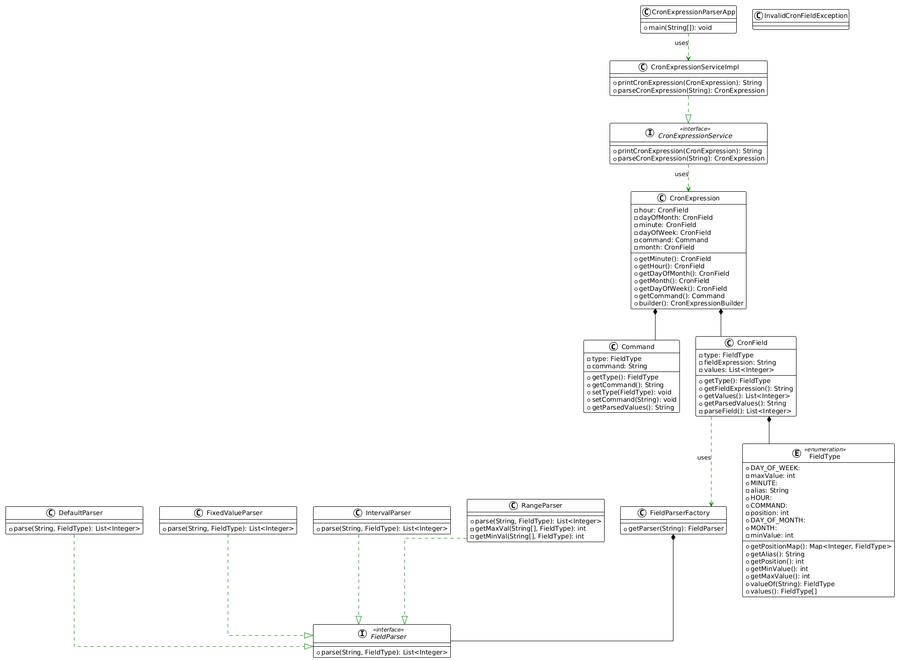

# Cron Expression Parser Documentation

## 1. **Project Overview**
This project is a Java-based Cron Expression Parser designed to interpret and provide readable outputs for cron expressions. Cron expressions are a format used to specify schedules for tasks to run at specific times or intervals. The parser breaks down each element of the cron expression (minute, hour, day of month, month, day of week) and provides human-readable outputs.

## 2. **Technologies Used**
- **Java**: The main programming language used for developing the parser.
- **Maven**: The build automation tool used to manage project dependencies and lifecycle.
  
## 3. **Project Structure**
The project follows a standard Maven project structure:
```
CronParser/
│
├── src/
│   ├── main/
│   │   ├── java/       # Java source code files
│   │   └── resources/  # Any configuration or resource files
│   └── test/
│       ├── java/       # Test files
│       └── resources/  # Test resources
├── pom.xml             # Maven configuration and dependency management file
└── README.md           # General project documentation
```

## 4. **Installation Instructions**
### Prerequisites:
- Java 8 or later
- Maven 3.6 or later

### Steps to build the project:
1. Clone the repository:
   ```bash
   git clone <repository-url>
   cd CronExpressionParser
   ```

2. Build the project using Maven:
   ```bash
   mvn clean install
   ```

This command will compile the code and run any unit tests.

## 5. **Running the Application**
Once the project is built, you can run the Cron Expression Parser with the following command:

```bash
java -jar target/CronExpressionParser-1.0-SNAPSHOT.jar "<cron-expression>"
```

For example:
```bash
java -jar target/CronExpressionParser-1.0-SNAPSHOT.jar "*/5 0 1,15 * 1-5 /usr/bin/find"
```

This command will parse the cron expression and print out a readable schedule.

## 6. **Project Dependencies**
The project's dependencies are managed through the `pom.xml` file. The key dependencies include:

- **JUnit**: For unit testing.
- **AssertJ**: For Assertion
- **Lombok**: For Basic utils

The `pom.xml` file contains the following main dependencies:
```xml
 <dependencies>
   <dependency>
      <groupId>org.projectlombok</groupId>
      <artifactId>lombok</artifactId>
      <version>1.18.34</version>
   </dependency>

   <dependency>
      <groupId>org.junit.jupiter</groupId>
      <artifactId>junit-jupiter</artifactId>
      <version>5.8.2</version>
      <scope>test</scope>
   </dependency>
   
   <dependency>
      <groupId>org.assertj</groupId>
      <artifactId>assertj-core</artifactId>
      <version>3.26.3</version>
      <scope>test</scope>
   </dependency>
</dependencies>
```

## 7. **Usage**
### Input Format
The parser expects a valid cron expression in the following format:
```
<minute> <hour> <day-of-month> <month> <day-of-week> <command>
```
For example:
```
*/5 0 1,15 * 1-5 /usr/bin/find
```

### Output Format
The parser will return a detailed breakdown of each field in the cron expression. For the above input, the output would look something like this:
```
Minute        : 0 5 10 15 20 25 30 35 40 45 50 55
Hour          : 0
Day of Month  : 1 15
Month         : 1 2 3 4 5 6 7 8 9 10 11 12
Day of Week   : 1 2 3 4 5
Command       : /usr/bin/find
```

## 8. **Testing**
The project includes unit tests that can be run using Maven:
```bash
mvn test
```

## 9. ** UML diagram**
